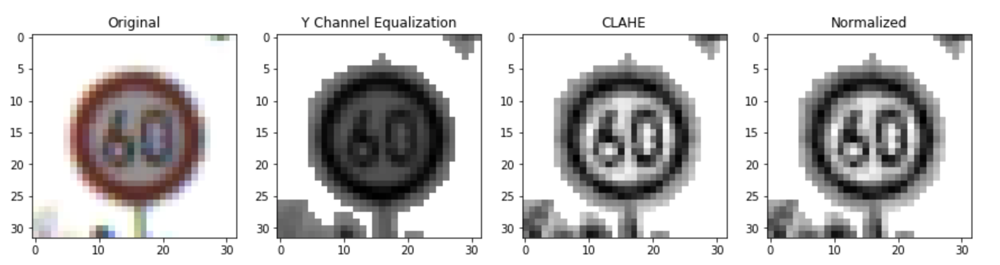

# Traffic Sign Recognition

---
## Goal

**Build a Traffic Sign Recognition Project**

The goals / steps of this project are the following:

* Load the data set (see below for links to the project data set)
* Explore, summarize and visualize the data set
* Design, train and test a model architecture
* Use the model to make predictions on new images
* Analyze the softmax probabilities of the new images
* Summarize the results with a written report

---
## Refelction
Here I will consider the [rubric points](https://review.udacity.com/#!/rubrics/481/view) individually and describe how I addressed each point in my implementation.

### 1. Data Set Summary & Exploration

#### Basic summary of the data set
The dataset consists of 34,799 32×32 pixels color images (32×32×3 array of RGB values) used for training, and 4410 images for cross validation, and 12,630 images that will be used for testing. Each image is a photo of a traffic sign belonging to one of 43 classes (marked as an integer [0,42]).

I used the pandas and numpy to calculate summary statistics of the traffic signs data set:

* The size of training set is **34,799**
* The size of the validation set is **4,410**
* The size of test set is **12,630**
* The shape of a traffic sign image is **(32,32,3)**
* The number of unique classes/labels in the data set is **43**

#### Visualization of the dataset

Here are some traffic sign image samples.

However, the training data distribution of all the 43 classes are totally unbalanced, nearly half of the classes have less than 500 sample data.

### 2. Data Augmentation

To tackle the problem of unbalanced distribution, I used the idea from [this post](https://navoshta.com/traffic-signs-classification/). Firstly flipping, then transformation(rotation/projection).

**Flipping**

The idea is that we can extend the dataset by flipping for some traffic signs (Images are from the post mentioned above).

After flipping, the training data set has been extended to **59,788**. 

**Transformation**

Several image transforming techniques can be applied to the traffic sign images to extend the data set. These techniques are: 

* **Scaling**
* **Translation**
* **Rotation**
* **Projection**

Here is the example.

I randomly choose these techniques to extend each class to **15,000** images. The training dataset now has **645K** images (15,000 x 43).

### 3. Pre-processing

I got the pre-processing idea from a [Udacity Discussion Post](https://discussions.udacity.com/t/train-valid-test-image-processing/401452/8) and [Sermanet and LeCun's paper](http://yann.lecun.com/exdb/publis/pdf/sermanet-ijcnn-11.pdf). I used the following steps of processing.

* **Grayscale and Equalization on Y Channel**
* **CLAHE** (Contrast Limited Adaptive Histogram Equalization)
* **Normalization** normalize the value to **[-1,1]**

Here are the processing results after each step.

I found the pre-processing techniques very helpful to train the model.

**Update After Review**

The reason I only used channel Y instead of RGB is beacause I found using RGB didn't bring much good for accuracy but only much more computational workload. (I might want to re-consider this).

### 4. Model Architecture

#### Summary
* I used 3 different models for the traffic sign classifier: LeNet5, LeNet5 + Dropouts, and Sermanet.
* With the extended dataset and LeNet5, I got 95.0% for validation accuracy and 94.3% for test accuracy respectively. 
* Then I tried to add 4 Dropouts in each convolution layers and fully connected layers. I set the keep rates to 0.9, 0.8, 0.7 and 0.5. And also, I added more filters in each layer.

	| Layer     |     Filters | Keep Rate
	|:---------:|:-----------:|:-----------:| 
	| conv_1    | 6 --> 16 | 0.9|
	| conv-2    | 16 --> 64 | 0.8|
	| FC_1		  |	 400 --> 1600	 | 0.7|
	| FC_2	|  | 0.5|
* Inspired by [Sermanet and LeCun's paper](http://yann.lecun.com/exdb/publis/pdf/sermanet-ijcnn-11.pdf), I created a 2 convolution layers Sermanet. The major idea is that both 2 convolution layers outputs will be fed into the fully connected layer (multi-scale features).

#### The Models
 
##### Model 1 - LeNet5

| Layer         		|     Description	    | 
|:-----------------:|:---------------------:| 
| Input         		| 32x32x3 RGB image | 
| Convolution 5x5   | 1x1 stride, VALID padding, outputs 28x28x6 |
| RELU					|						|
| Max pooling	      	| 2x2 stride,  outputs 14x14x6 |
| Convolution 5x5	| 1x1 stride, VALID padding, outputs 10x10x16 |
| RELU					|						|
| Max pooling	      	| 2x2 stride,  outputs 5x5x16 |
| Flatten				| outputs 400			|
| Fully connected	| outputs 120   		|
| RELU					|						|
| Fully connected	| outputs 84        |
| RELU					|						|
| Fully connected	| outputs 43			|

##### Model 2 - LeNet5 + Dropouts

| Layer         		|     Description	    | 
|:-----------------:|:---------------------:| 
| Input         		| 32x32x3 RGB image | 
| Convolution 5x5   | 1x1 stride, VALID padding, outputs 28x28x16 |
| RELU					|						|
| Max pooling	      	| 2x2 stride,  outputs 14x14x16 |
| Dropout				| Keep = 0.9			|
| Convolution 5x5	| 1x1 stride, VALID padding, outputs 10x10x64 |
| RELU					|						|
| Max pooling	      	| 2x2 stride,  outputs 5x5x64 |
| Dropout				| Keep = 0.8			|
| Flatten				| outputs 1600		|
| Fully connected	| outputs 120   		|
| RELU					|						|
| Dropout				| Keep = 0.7			|
| Fully connected	| outputs 84        |
| RELU					|						|
| Dropout				| Keep = 0.5			|
| Fully connected	| outputs 43			|

##### Model 3 - Sermanet (Multi-Scale Features) - 2 convolution layers

| Layer         		|     Description	        | 
|:---------------------:|:---------------------:| 
| Input         		| 32x32x1 Grayscale image | 
| Convolution 5x5   | 1x1 stride, SAME padding, outputs 32x32x16 |
| RELU					|						|
| Max pooling	      	| 2x2 stride,  outputs 16x16x16, name='pool1' |
| Dropout				| Keep = 0.9			|
| Convolution 5x5	| 1x1 stride, SAME padding, outputs 16x16x32 |
| RELU					|						|
| Max pooling	      	| 2x2 stride,  outputs 8x8x32, name='pool2' |
| Dropout				| Keep = 0.8			|
| Flatten				| input1 = 'pool1'->4x4x16, input2='pool2'->4x4x32  outputs 768|
| Fully connected	| outputs 120   		|
| RELU					|						|
| Dropout				| Keep = 0.5			|
| Fully connected	| outputs 43			|

### 5. Train the model

#### Hyperparameters
* **Epoches:** 80~120
* **Batch Size:** 128/256
* **Learning Rate:** 0.001/0.0001
* **Mean/Sigma:** 0/0.1
* **Optimizer:** Adam Optimizer

#### Training
I used 2-stage training to train and fine tune the model.

* **Stage 1: Train with big step.** Find the highest validation accuracy in the first 40~60 epochs, with learning rate 0.001 and Adam Optimizer. Save the model for the next stage.

* **Stage 2: Fine tuning with small step.** Use another 40~60 epochs with learning rate = 0.0001 

**Tips:**

* **Shuffle** the training data at the beginning of each epoch.
* **DO NOT** call tf.global_variables_initializer() at the stage 2 when use loaded model to continue training.

#### Performance

| Model|Training Accuracy| Validation Accuracy| Test Accuracy | 
|:-----:|:---------:|:-----------:|:------------:| 
| LeNet5        		| 99.9%		| 95.0%|94.3%|
| LeNet5 + Dropouts | 99.9%		|99.2% |98.3%|
| Sermanet (Multi-Scale Features)	|	99.9%| 98.5%|97.1%|

According to [Sermanet and LeCun's paper](http://yann.lecun.com/exdb/publis/pdf/sermanet-ijcnn-11.pdf), Sermanet should have **99%+** test accuracy, because of using multi-scale features. However I got slightly worse performance (compared to LeNet5 + Dropouts), I am still working on that. 

### 6. Test a Model on New Images

I used the Sermanet model (supposed to have the best performance) to test on new images.  

Firstly, I manually corp the 5 images to 32*32, and let the sign at the center.

Then, I pre-processed the new images and used the trained model to make the predictions.

I got 5 correct out of 5 (100%). Here are the results:

| Image			        |     Prediction| 
|:---------------------:|:---------------------------------------------:| 
| s01-vechiles      		| Vechiles over 3.5 metric tons prohibited		| 
| s02-Stop     			| Stop |
| s03-Pedestrians					| Pedestrians|
| s04-Children crossing	      	| Children crossing|
| s05-Roadwork			| Road Work    |

#### Top 5 probabilities for each image

**(Update After Review)**

##### Image 1: Vechiles

For the first image contains the sign of "Vechiles over 3.5 metric tons prohibited", the model classifies it right, and is pretty certain - with probability of 99.997%.

| Probability         	|     Prediction	        | 
|:---------------------:|:------------------------------:| 
| 0.99997   | Vechiles over 3.5 metric tons prohibited   | 
| 0.00002     				| Speed limit (80km/h) |
| 0.00001					| Roundabout mandatory|
| 0.00000	      			| No passing		|
| 0.00000				    | Speed limit (100km/h)   |

##### Image 2: Stop

For the second image contains the sign of "Stop", the model classifies it right, and is pretty certain - with probability of 100%.

| Probability         	|     Prediction	        | 
|:---------------------:|:---------------------------------------------:| 
| 1.00000         			| Stop  	| 
| 0.00000     				| Speed limit (60km/h) |
| 0.00000					| Priority road	|
| 0.00000	      			| Speed limit (80km/h)|
| 0.00000				    | Keep right   |

##### Image 3: Pedestrians

For the third image which contains the sign of "Pedestrians", the model classifies it right, and is pretty certain - with probability of 99.98%.

| Probability         	|     Prediction	        | 
|:---------------------:|:---------------------------------------------:| 
| 0.99998         			| Pedestrians	| 
| 0.00002					| Right-of-way at the next intersection|
| 0.00000	      			| General caution|
| 0.00000     				| Road narrows on the right |
| 0.00000				    | Road work   |

##### Image 4: Children crossing

For the fourth image contains the sign of "Children crossing", the model classifies it right, and is pretty certain - with probability of 88.68%.

| Probability         	|     Prediction	        | 
|:---------------------:|:---------------------------------------------:| 
| 0.88675         			| Children crossing| 
| 0.04842     				| Slippery road|
| 0.02637					| Beware of ice/snow|
| 0.00981	      			| Road work|
| 0.00891				    | Speed limit (80km/h)   |

##### Image 5: Road work

For the fifth image contains the sign of "Road work", the model classifies it right, and is pretty certain - with probability of 99.54%.

| Probability         	|     Prediction	        | 
|:---------------------:|:---------------------------------------------:| 
| 0.99537         			| Road work| 
| 0.00429     				| Priority road|
| 0.00031					| Bicycles crossing|
| 0.00001	      			| Speed limit (30km/h)|
| 0.00001				    | Beware of ice/snow |

#### Discussion (Update After Review)

* The first 3 images are relatively easy for the model to classify, because they are pretty clear, up front and no distortion or anything. The model has been trained with many images like this, and the model is very certain about the result (close to 100%).

* The fourth image (children crossing) is a chanllege, because it is not taken from the up front(it's from lower position). The original traninng dataset doesn't have much samples of this kind. Using projection and rotation technique to extend the training data helps a lot in this scenario, the model correctly classifies this image.

* The fifth image (road work) is also a difficult one. It is taken from night, and also partialy covered by snow. I specially checked that the training data has 1350 "road work" image under various conditions, and after extended by several augmentation techniques, the model learned a lot about the "Road work" sign, so it also correctly classifies the image.
Here are some samples of "Road work" training data.

* To better understand the performance of my model, I checked the images in test data the model couldn't claasify correctly. To clarify, most of the images either have shadows, blocking objects, or too dark or blurry. According to reviewer's feedback, I would consider generate images with more noise to train the model, and some sort of color information may also helpful. 

Here are some examples the model couldn't classify correctly.

**Original**

**Preprocessed**

### 7. (Optional) Visualizing the Neural Network 

Here is to visualize the **Sermanet** which has 2 convolution layers. 

#### First convolution layer's output (16 filters)

#### Second convolution layer's output (32 filters)

