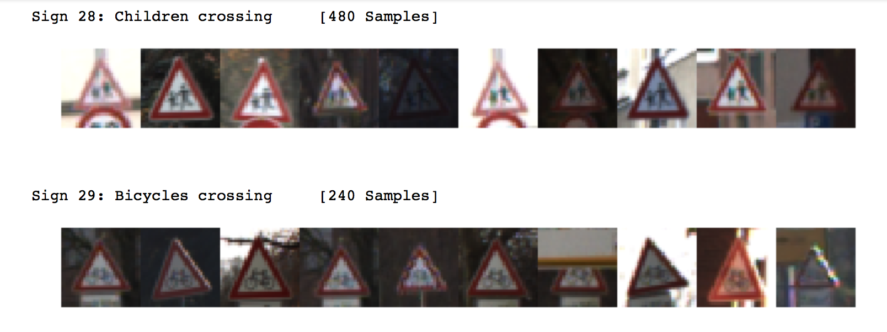
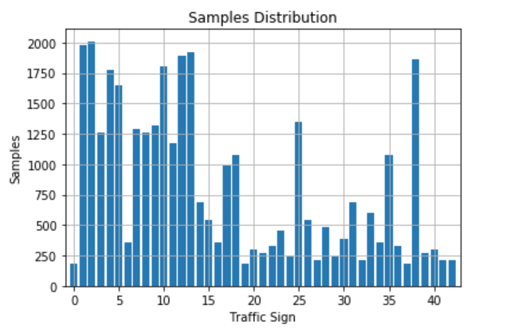
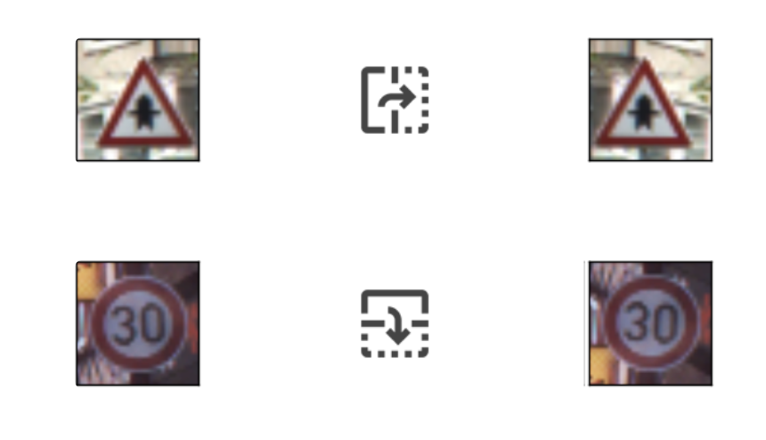
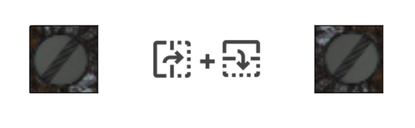
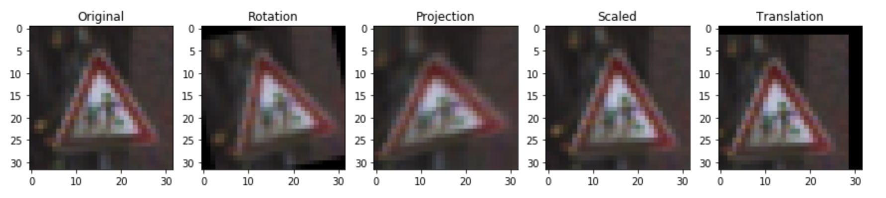
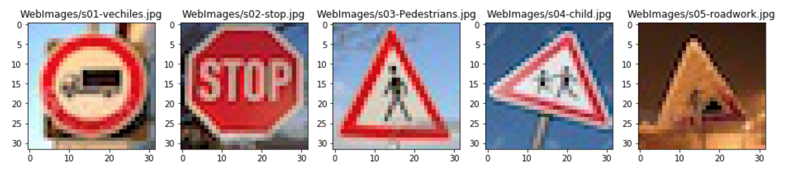
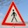

#**Traffic Sign Recognition** 

---
## Goal

**Build a Traffic Sign Recognition Project**

The goals / steps of this project are the following:
* Load the data set (see below for links to the project data set)
* Explore, summarize and visualize the data set
* Design, train and test a model architecture
* Use the model to make predictions on new images
* Analyze the softmax probabilities of the new images
* Summarize the results with a written report

---
## Refelction
Here I will consider the [rubric points](https://review.udacity.com/#!/rubrics/481/view) individually and describe how I addressed each point in my implementation.

### 1. Data Set Summary & Exploration

#### Basic summary of the data set
The dataset consists of 34,799 32×32 pixels color images (32×32×3 array of RGB values) used for training, and 4410 images for cross validation, and 12,630 images that will be used for testing. Each image is a photo of a traffic sign belonging to one of 43 classes (marked as an integer [0,42]).

I used the pandas and numpy to calculate summary statistics of the traffic signs data set:

* The size of training set is **34,799**
* The size of the validation set is **4,410**
* The size of test set is **12,630**
* The shape of a traffic sign image is **(32,32,3)**
* The number of unique classes/labels in the data set is **43**

####Visualization of the dataset

Here are some traffic sign image samples.

However, the training data distribution of all the 43 classes are totally unbalanced, nearly half of the classes have less than 500 sample data.

### 2. Data Augmentation

To tackle the problem of unbalanced distribution, I used the idea from [this post](https://navoshta.com/traffic-signs-classification/). Firstly flipping, then transformation(rotation/projection).

**Flipping**

The idea is that we can extend the dataset by flipping for some traffic signs (Images are from the post mentioned above).

After flipping, the training data set has been extended to **59,788**. 

**Transformation**

Several image transforming techniques can be applied to the traffic sign images to extend the data set. These techniques are: 

* **Scaling**
* **Translation**
* **Rotation**
* **Projection**

Here is the example.

I randomly choose these techniques to extend each class to **12,000** images. The training dataset now has **516K** images (12,000 x 43).

###3. Pre-processing

I got the pre-processing idea from a [Udacity Discussion Post](https://discussions.udacity.com/t/train-valid-test-image-processing/401452/8). I followed the following steps.

* **Grayscale and Equalization on Y Channel**
* **CLAHE**
* **Normalization**

Here are the example results after each step.

###4. Model Architecture

I started with the simple model - LeNet5, 

 
####Model 1 - LeNet5

| Layer         		|     Description	    | 
|:-----------------:|:---------------------:| 
| Input         		| 32x32x3 RGB image | 
| Convolution 5x5   | 1x1 stride, VALID padding, outputs 28x28x6 |
| RELU					|						|
| Max pooling	      	| 2x2 stride,  outputs 14x14x6 |
| Convolution 5x5	| 1x1 stride, VALID padding, outputs 10x10x16 |
| RELU					|						|
| Max pooling	      	| 2x2 stride,  outputs 5x5x16 |
| Flatten				| outputs 400			|
| Fully connected	| outputs 120   		|
| RELU					|						|
| Fully connected	| outputs 84        |
| RELU					|						|
| Fully connected	| outputs 43			|

####Model 2 - LeNet5 + Dropouts

| Layer         		|     Description	    | 
|:-----------------:|:---------------------:| 
| Input         		| 32x32x3 RGB image | 
| Convolution 5x5   | 1x1 stride, VALID padding, outputs 28x28x16 |
| RELU					|						|
| Max pooling	      	| 2x2 stride,  outputs 14x14x16 |
| Dropout				| Keep = 0.9			|
| Convolution 5x5	| 1x1 stride, VALID padding, outputs 10x10x64 |
| RELU					|						|
| Max pooling	      	| 2x2 stride,  outputs 5x5x64 |
| Dropout				| Keep = 0.8			|
| Flatten				| outputs 1600		|
| Fully connected	| outputs 120   		|
| RELU					|						|
| Dropout				| Keep = 0.7			|
| Fully connected	| outputs 84        |
| RELU					|						|
| Dropout				| Keep = 0.5			|
| Fully connected	| outputs 43			|

####Model 3 - Sermanet (Multi-Scale Features) - 2 convolution layers

| Layer         		|     Description	        | 
|:---------------------:|:---------------------:| 
| Input         		| 32x32x1 Grayscale image | 
| Convolution 5x5   | 1x1 stride, SAME padding, outputs 32x32x16 |
| RELU					|						|
| Max pooling	      	| 2x2 stride,  outputs 16x16x16, name='pool1' |
| Dropout				| Keep = 0.9			|
| Convolution 5x5	| 1x1 stride, SAME padding, outputs 16x16x32 |
| RELU					|						|
| Max pooling	      	| 2x2 stride,  outputs 8x8x32, name='pool2' |
| Dropout				| Keep = 0.8			|
| Flatten				| input1 = 'pool1'->4x4x16, input2='pool2'->4x4x32  outputs 768|
| Fully connected	| outputs 120   		|
| RELU					|						|
| Dropout				| Keep = 0.5			|
| Fully connected	| outputs 43			|

###5. Train the model

#### Hyperparameters
* **Epoches:** 80~120
* **Batch Size:** 128
* **Learning Rate:** 0.0001
* **Mean/Sigma:** 0/0.1
* **Optimizer:** Adam Optimizer

#### Validation Accuracy over epoches

Sample: LeNet 5 - 80 epoches

####Performance
| Model         		|Training Accuracy| Validation Accuracy| Test Accuracy | 
|:-----------------:|:------------------:|:-----------------:|:------------------:| 
| LeNet5        		| 100%					 | 95.0%|94.3%|
| LeNet5 + Dropouts | 100%				 |99.2% |98.3%|
| Sermanet (Multi-Scale Features)	|	100%| 99.0%|97.4%|

According to [Sermanet and LeCun's paper](http://yann.lecun.com/exdb/publis/pdf/sermanet-ijcnn-11.pdf), Sermanet should have **99%+** test accuracy, because of using multi-scale features. However I got slightly worse performance (compared to LeNet5 + Dropouts), I am still working on that. 

###6. Test a Model on New Images

I used the best performance model (LeNet5 + Dropouts) to test on new images.  

Firstly, I manually corp the 5 images to 32*32, and let the sign at the center.

Then, I pre-processed the new images and used the trained model to make the predictions.

I got 4 correct out of 5 (80%). Here are the results:

| Image			        |     Prediction| 
|:---------------------:|:---------------------------------------------:| 
| s01-Yield      		| Yield		| 
| s02-Road work     			| Road Work |
| s03-Pedestrians					| Pedestrians|
| s04-Children crossing	      	| Pedestrians|
| s05-Ice			| Beware of ice/snow    |

#### Top 5 probabilities for each image

| Probability         	|     Prediction	        | 
|:---------------------:|:---------------------------------------------:| 
| 1.00000         			| Yield   	| 
| 0.00000     				| Priority road |
| 0.00000					| Ahead only		|
| 0.00000	      			| Keep right		|
| 0.00000				    | No vechiles   |

| Probability         	|     Prediction	        | 
|:---------------------:|:---------------------------------------------:| 
| 0.99992         			| Road work  	| 
| 0.00002     				| Pedestrians |
| 0.00002					| Bumpy road		|
| 0.00001	      			| Beware of ice/snow|
| 0.00001				    | Traffic signals   |

| Probability         	|     Prediction	        | 
|:---------------------:|:---------------------------------------------:| 
| 0.99998         			| Pedestrians	| 
| 0.00001     				| Road narrows on the right |
| 0.00000					| Right-of-way at the next intersection|
| 0.00000	      			| General caution|
| 0.00000				    | Traffic signals   |

| Probability         	|     Prediction	        | 
|:---------------------:|:---------------------------------------------:| 
| 0.23990         			| Pedestrians	| 
| 0.15284     				| Right-of-way at the next intersection|
| 0.12924					| Traffic signals|
| 0.07557	      			| General caution|
| 0.06851				    | Children crossing   |

| Probability         	|     Prediction	        | 
|:---------------------:|:---------------------------------------------:| 
| 0.99997         			| Beware of ice/snow| 
| 0.00001     				| Right-of-way at the next intersection|
| 0.00001					| Road work|
| 0.00000	      			| Bicycles crossing|
| 0.00000				    | Slippery road   |

###Design and Test a Model Architecture

####1. Describe how you preprocessed the image data. What techniques were chosen and why did you choose these techniques? Consider including images showing the output of each preprocessing technique. Pre-processing refers to techniques such as converting to grayscale, normalization, etc. (OPTIONAL: As described in the "Stand Out Suggestions" part of the rubric, if you generated additional data for training, describe why you decided to generate additional data, how you generated the data, and provide example images of the additional data. Then describe the characteristics of the augmented training set like number of images in the set, number of images for each class, etc.)

As a first step, I decided to convert the images to grayscale because ...

Here is an example of a traffic sign image before and after grayscaling.

![alt text][image2]

As a last step, I normalized the image data because ...

I decided to generate additional data because ... 

To add more data to the the data set, I used the following techniques because ... 

Here is an example of an original image and an augmented image:

![alt text][image3]

The difference between the original data set and the augmented data set is the following ... 

####2. Describe what your final model architecture looks like including model type, layers, layer sizes, connectivity, etc.) Consider including a diagram and/or table describing the final model.

My final model consisted of the following layers:

| Layer         		|     Description	        | 
|:---------------------:|:---------------------------------------------:| 
| Input         		| 32x32x3 RGB image | 
| Convolution 3x3   | 1x1 stride, same padding, outputs 32x32x64 |
| RELU					|						|
| Max pooling	      	| 2x2 stride,  outputs 16x16x64 |
| Convolution 3x3	| etc.      			|
| Fully connected	| etc.        		|
| Softmax				| etc.        		|
|						|						|
|						|						|
 

####3. Describe how you trained your model. The discussion can include the type of optimizer, the batch size, number of epochs and any hyperparameters such as learning rate.

To train the model, I used an ....

####4. Describe the approach taken for finding a solution and getting the validation set accuracy to be at least 0.93. Include in the discussion the results on the training, validation and test sets and where in the code these were calculated. Your approach may have been an iterative process, in which case, outline the steps you took to get to the final solution and why you chose those steps. Perhaps your solution involved an already well known implementation or architecture. In this case, discuss why you think the architecture is suitable for the current problem.

My final model results were:
* training set accuracy of ?
* validation set accuracy of ? 
* test set accuracy of ?

If an iterative approach was chosen:
* What was the first architecture that was tried and why was it chosen?
* What were some problems with the initial architecture?
* How was the architecture adjusted and why was it adjusted? Typical adjustments could include choosing a different model architecture, adding or taking away layers (pooling, dropout, convolution, etc), using an activation function or changing the activation function. One common justification for adjusting an architecture would be due to overfitting or underfitting. A high accuracy on the training set but low accuracy on the validation set indicates over fitting; a low accuracy on both sets indicates under fitting.
* Which parameters were tuned? How were they adjusted and why?
* What are some of the important design choices and why were they chosen? For example, why might a convolution layer work well with this problem? How might a dropout layer help with creating a successful model?

If a well known architecture was chosen:
* What architecture was chosen?
* Why did you believe it would be relevant to the traffic sign application?
* How does the final model's accuracy on the training, validation and test set provide evidence that the model is working well?
 

###Test a Model on New Images

####1. Choose five German traffic signs found on the web and provide them in the report. For each image, discuss what quality or qualities might be difficult to classify.

Here are five German traffic signs that I found on the web:

![alt text][image4] ![alt text][image5] ![alt text][image6] 
![alt text][image7] ![alt text][image8]

The first image might be difficult to classify because ...

####2. Discuss the model's predictions on these new traffic signs and compare the results to predicting on the test set. At a minimum, discuss what the predictions were, the accuracy on these new predictions, and compare the accuracy to the accuracy on the test set (OPTIONAL: Discuss the results in more detail as described in the "Stand Out Suggestions" part of the rubric).

Here are the results of the prediction:

| Image			        |     Prediction	        					| 
|:---------------------:|:---------------------------------------------:| 
| Stop Sign      		| Stop sign   									| 
| U-turn     			| U-turn 										|
| Yield					| Yield											|
| 100 km/h	      		| Bumpy Road					 				|
| Slippery Road			| Slippery Road      							|

The model was able to correctly guess 4 of the 5 traffic signs, which gives an accuracy of 80%. This compares favorably to the accuracy on the test set of ...

####3. Describe how certain the model is when predicting on each of the five new images by looking at the softmax probabilities for each prediction. Provide the top 5 softmax probabilities for each image along with the sign type of each probability. (OPTIONAL: as described in the "Stand Out Suggestions" part of the rubric, visualizations can also be provided such as bar charts)

The code for making predictions on my final model is located in the 11th cell of the Ipython notebook.

For the first image, the model is relatively sure that this is a stop sign (probability of 0.6), and the image does contain a stop sign. The top five soft max probabilities were

| Probability         	|     Prediction	        					| 
|:---------------------:|:---------------------------------------------:| 
| .60         			| Stop sign   									| 
| .20     				| U-turn 										|
| .05					| Yield											|
| .04	      			| Bumpy Road					 				|
| .01				    | Slippery Road      							|

For the second image ... 

### (Optional) Visualizing the Neural Network (See Step 4 of the Ipython notebook for more details)
####1. Discuss the visual output of your trained network's feature maps. What characteristics did the neural network use to make classifications?

